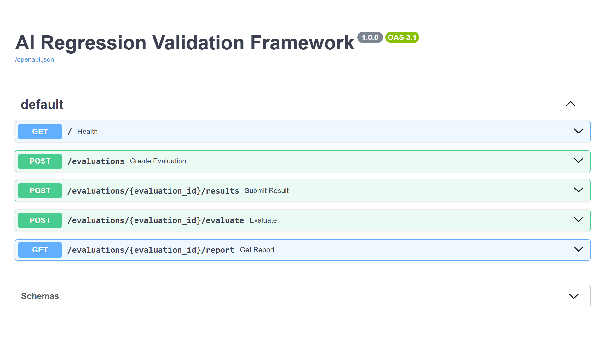
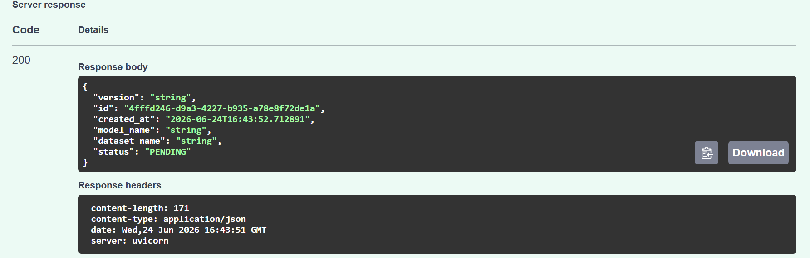
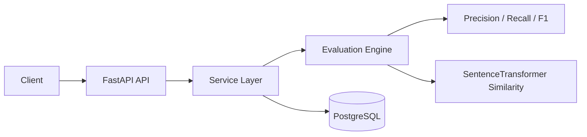

# AI Regression Validation Framework

AI Regression Validation Framework is a FastAPI service for validating AI model outputs, calculating regression metrics, and storing evaluation history in PostgreSQL.

## Resume Highlights

* Built a containerized FastAPI evaluation service with Docker Compose and PostgreSQL.
* Implemented automated Docker-based tests: `12 passed, 1 warning`.
* Added GitHub Actions CI to run tests and build the Docker image.
* Added Kubernetes manifests for API deployment, service exposure, probes, and resource limits.
* Benchmarked the API with realistic evaluation payloads: `0.00%` error rate across `30` requests.

## Quick Start

Start the API and PostgreSQL:

```bash
docker compose up -d
```

Open the API docs:

```text
http://localhost:8000/docs
```

Stop the stack:

```bash
docker compose down
```

## Testing

Docker is the canonical development and test environment for this project.

```bash
docker compose run --rm api sh -c "pip install -r requirements-dev.txt && python -m pytest tests -v"
```

Latest verified result:

```text
12 passed, 1 warning
```

## Benchmarking

Run the benchmark after starting Docker Compose:

```bash
python3 scripts/benchmark.py
```

Latest benchmark summary:

* Total requests: `30`
* Throughput: `0.28 requests/sec`
* Error rate: `0.00%`
* p50 latency: `60.83 ms`
* p95 latency: `2307.63 ms`
* p99 latency: `100459.07 ms`

The p99 value is a cold-start outlier from the first real semantic evaluation, when the SentenceTransformer model initializes. Steady-state non-evaluation endpoints are much lower; see [`docs/metrics.md`](docs/metrics.md).

## Demo

Swagger UI:



Evaluation created response:



Video walkthrough: placeholder for a future recording.

## Architecture



## System Workflow

1. Create an evaluation request.
2. Submit expected and actual model outputs.
3. Calculate precision, recall, F1, and semantic similarity.
4. Detect regression status.
5. Store the report in PostgreSQL.

## Project Status

* Docker Compose runs the API with PostgreSQL.
* Docker-based tests are documented and verified.
* GitHub Actions runs tests and builds the Docker image.
* Kubernetes manifests are available in `k8s/`.
* Benchmark results are available in [`docs/metrics.md`](docs/metrics.md).

## Technology Stack

* FastAPI
* SQLAlchemy
* PostgreSQL
* Sentence Transformers
* PyTest
* Docker Compose
* GitHub Actions
* Kubernetes manifests
